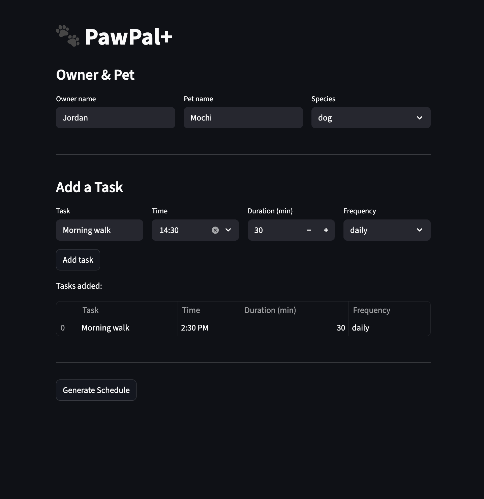

# PawPal+ (Module 2 Project)

You are building **PawPal+**, a Streamlit app that helps a pet owner plan care tasks for their pet.

## Scenario

A busy pet owner needs help staying consistent with pet care. They want an assistant that can:

- Track pet care tasks (walks, feeding, meds, enrichment, grooming, etc.)
- Consider constraints (time available, priority, owner preferences)
- Produce a daily plan and explain why it chose that plan

Your job is to design the system first (UML), then implement the logic in Python, then connect it to the Streamlit UI.

## What you will build

Your final app should:

- Let a user enter basic owner + pet info
- Let a user add/edit tasks (duration + priority at minimum)
- Generate a daily schedule/plan based on constraints and priorities
- Display the plan clearly (and ideally explain the reasoning)
- Include tests for the most important scheduling behaviors

## Getting started

### Setup

```bash
python -m venv .venv
source .venv/bin/activate  # Windows: .venv\Scripts\activate
pip install -r requirements.txt
```

## Features

- **Sorting by time** — tasks are always displayed in chronological order using `sorted()` with a `strptime` key
- **Conflict warnings** — if two tasks overlap, the app flags them with a warning instead of silently dropping either one
- **Daily and weekly recurrence** — completing a recurring task automatically creates the next occurrence using `timedelta`
- **Filter by pet or status** — view only one pet's tasks, or just what's still pending for the day
- **Multi-pet support** — one owner can have multiple pets, each with their own task list

## Smarter Scheduling

Recurring tasks auto-schedule themselves, conflicts throw a warning, and you can filter by pet or status.

## Testing PawPal+

`python -m pytest`
There is 5 test: mark a test complete, add a task for pet, sort time, complete task and get, check two overlap.
4.5 confidence in relability

### Suggested workflow

1. Read the scenario carefully and identify requirements and edge cases.
2. Draft a UML diagram (classes, attributes, methods, relationships).
3. Convert UML into Python class stubs (no logic yet).
4. Implement scheduling logic in small increments.
5. Add tests to verify key behaviors.
6. Connect your logic to the Streamlit UI in `app.py`.
7. Refine UML so it matches what you actually built.


