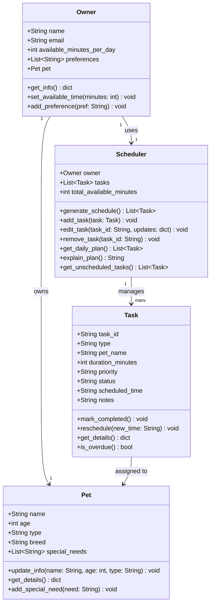

```mermaid
classDiagram
    class Owner {
        +String name
        +String email
        +int available_minutes_per_day
        +List~String~ preferences
        +Pet pet
        +get_info() dict
        +set_available_time(minutes: int) void
        +add_preference(pref: String) void
    }

    class Pet {
        +String name
        +int age
        +String type
        +String breed
        +List~String~ special_needs
        +update_info(name: String, age: int, type: String) void
        +get_details() dict
        +add_special_need(need: String) void
    }

    class Task {
        +String task_id
        +String type
        +String pet_name
        +int duration_minutes
        +String priority
        +String status
        +String scheduled_time
        +String notes
        +mark_completed() void
        +reschedule(new_time: String) void
        +get_details() dict
        +is_overdue() bool
    }

    class Scheduler {
        +Owner owner
        +List~Task~ tasks
        +int total_available_minutes
        +generate_schedule() List~Task~
        +add_task(task: Task) void
        +edit_task(task_id: String, updates: dict) void
        +remove_task(task_id: String) void
        +get_daily_plan() List~Task~
        +explain_plan() String
        +get_unscheduled_tasks() List~Task~
    }

    Owner "1" --> "1" Pet : owns
    Owner "1" --> "1" Scheduler : uses
    Scheduler "1" --> "many" Task : manages
    Task --> Pet : assigned to
```
